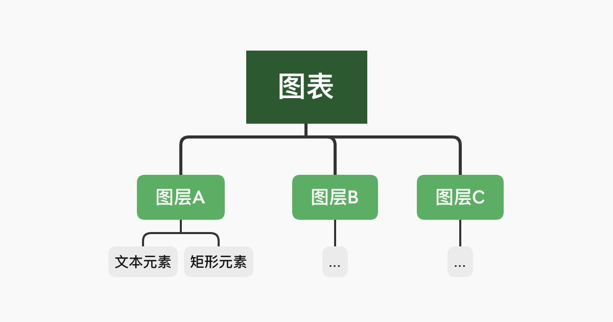

# 图表概念

矢量图是一种能很好地展示结构数据的图表类型，虽然这个图表库支持了多种渲染方式，如利用 [PIXI](https://github.com/pixijs/pixijs) 进行 `WebGL` 或 `Canvas` 进行绘制，但其设计始终和 `SVG` 最为匹配。

## 图表结构

将一个完整的矢量图表进行拆解，通常是下面这种结构：

图表是图层的组合。一个普通的柱状图一般包含四个图层，即：基础文字层（标题）、图例层、坐标轴层、矩形层。你可以在 [在线 DEMO](http://www.shuzhiwen.com/app/chart) 中找到对应的例子，在网站的左侧菜单选择柱状图-分组柱状。

## 图层间数据传递

基础柱状图的代码定义了四个图层，坐标轴层和图例层并没有定义 `data` 字段，这是因为它们的数据都来自于其他图层。

其中坐标轴的数据（主要是比例尺）通过 `src/core/chart` 中的 `rebuildScale` 函数传递，坐标轴层会融合相同类型的比例尺。例如矩形层和折线层的 X 轴比例尺都为离散的文本到连续的图表空间，Y 轴比例尺都为连续的数值到连续的图表空间，因此它们的比例尺可以融合，所以可以配置出“折柱图”这种组合图表。不同坐标系的比例尺不能进行融合，例如“雷达柱状图”这种图表就不存在，因为前者是极坐标系，后者是直角坐标系。

图例的数据显式定义在每个图层的实例内部，图例在其 `setData` 生命周期内会获取所有其他图层定义的图例数据，但并不是每个图层都需要显式定义图例数据，基础柱状图也仅仅只有矩形图层定义了图例数据。
